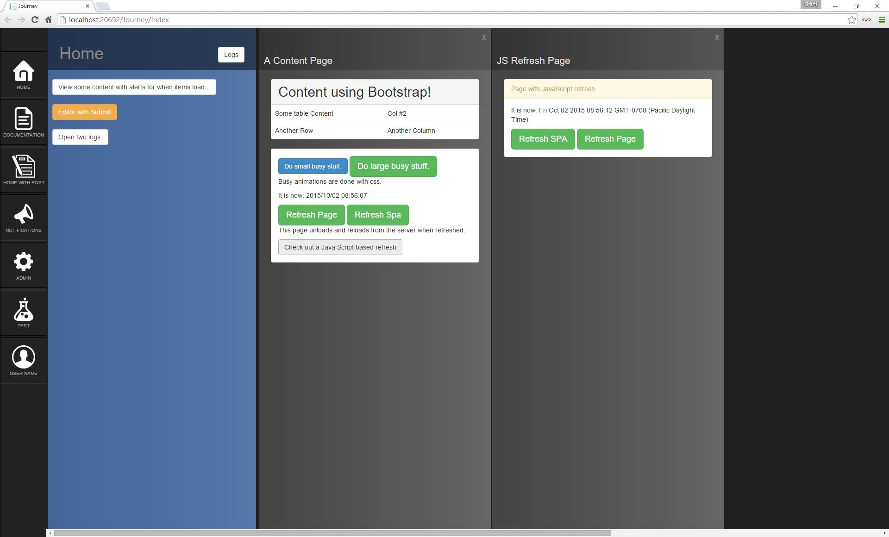

# Journey
Have you ever wanted to:
   1. Write a Single Page Application (SPA) but didn't want to hassle with complex frameworks.
   2. Write regular MVC-style pages but have your application behave like a SPA.
   3. Have a fluid navigation paradigm that allows users to keep context without having to reproduce it on each screen.

Journey is a simple JavaScript web framework with minimal dependencies that allows you to do these things.

When we developed Journey the primary use case was for line of business intranet applications. Being a general paradigm, it can work well for other cases too. The Journey paradigm works well for site where application context builds as the user explores into an area. For example, the user might select to view quarterly profits. Then they would view the categories for a quarter and then explore deeper into the customers in a category. All the time they would still have easy access to the original quarterly profits page and with a single click can view data for a different quarter. This eliminates many clicks and extra page navigations.

Please check out the wiki for complete documentation: [Wiki Docs](https://github.com/IntelliTect/journey/wiki/Home)

You can see a sample site here: [Journey Demo](http://journeydemo.azurewebsites.net/Journey)

###Note
Here is a short list of some of the features that are planned: 
   1. We continue to find and address navigation issues that were not forseen use cases.
   2. We would really like this to be responsive, but it isn't as of yet. (scaling well to non-desktop devices)
   3. Opening pages from external web sites can hihack the styling and functionality of the page. An Iframe option is coming.
